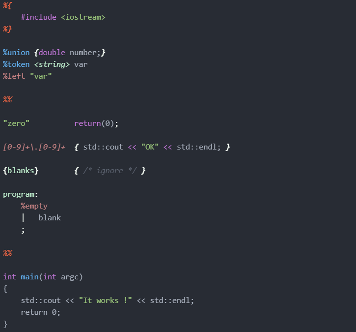

# Bison and Flex files highlighting

This package will highlight Bison/Yacc and Flex/Lex files.



## Dependencies

For versions 1.0.0 and above, it will work on apm >=2.0.0.
Previous versions are deprecated.

There's no other package dependency needed for this package.

## Installation

Open **File** → **Settings** → **Install** and search for `language-bison-flex`.

Alternatively, install through command-line:
```
apm install language-bison-flex
```

## Files support
The deal for this package is to manage both Bison and Flex files with on template, and with differents extensions.

```
# Bison
*.y *.ypp *.yy

# Flex
*.l *.ll *.lex *.flex
```

## Contributing

This package is open for contribution. Issues and Pull request tabs are for y'all !

A special thanks to those who helped for this package.

<a title="uchuugaka" href="https://github.com/uchuugaka"></a>
<a title="pablooliveira" href="https://github.com/pablooliveira"></a>
